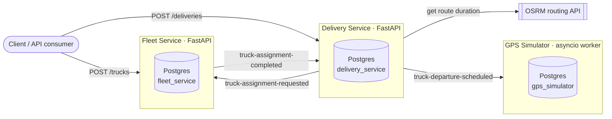

# FleetPulse

**An event-driven microservices backend for a delivery fleet — trucks, deliveries, and (soon) live GPS tracking simulation — built with FastAPI, Kafka and PostgreSQL.**

[](https://github.com/Kwuxy/fleetPulse/actions/workflows/tests.yml)
[](https://codecov.io/github/Kwuxy/fleetPulse)


FleetPulse models the backend of a logistics company: clients book deliveries, the system finds a truck able to carry the load, plans when it must leave to arrive on time, and simulates its journey. It is a personal project I use to practise the architecture and tooling of production microservice systems — asynchronous messaging, per-service data ownership, containerised infrastructure and a layered testing strategy — end to end, on a realistic domain.

---

## How it works



1. A client creates a delivery. **Delivery Service** stores it as `REQUESTED`, publishes a request on Kafka and answers immediately — the API is *eventually consistent*.
2. **Fleet Service** consumes the request, picks an available truck with enough capacity, and publishes the outcome (`ASSIGNED` or `DENIED` with a reason).
3. Delivery Service updates the delivery. On success, it asks the **OSRM** routing engine how long the trip takes, computes when the truck must leave, and publishes a departure event.
4. **GPS Simulator** consumes departure events and will simulate each truck driving its real road route, stepping through OSRM segment timings to publish realistic positions *(in progress)*.

The services never call each other over HTTP: Kafka is the only integration channel, and each service owns its own database.

## Tech stack

| Area | Tools |
|---|---|
| Services | Python 3.14, FastAPI, Pydantic v2, asyncio |
| Messaging | Apache Kafka (KRaft), aiokafka, Redpanda Console |
| Persistence | PostgreSQL, SQLAlchemy 2 (async, asyncpg), Alembic migrations |
| External APIs | OSRM routing via httpx |
| Testing | pytest, pytest-asyncio, pytest-cov, Testcontainers (Kafka & Postgres), respx |
| Continuous integration | GitHub Actions, Codecov |
| Infrastructure | Docker (multi-stage, non-root images), Docker Compose, Kubernetes (local), uv with one lockfile per service |

## Engineering highlights

- **Reliable message handling.** Consumers commit Kafka offsets manually, only once a message is fully processed — at-least-once delivery. Business rejections (unknown delivery, overweight cargo, no truck available) are resolved into an explicit `DENIED` outcome, while transient failures (e.g. OSRM outage) are left uncommitted so the message is redelivered. No request can get stuck silently.
- **Loosely coupled services.** Each service has its own database, its own user, and its own copy of the message schemas — no shared code or shared tables between services.
- **Layered architecture.** `routes / consumers → services → repositories → models` in every service, keeping business logic independent of HTTP and Kafka.
- **Testing pyramid.**
  - *Unit* tests for routes, services, producers and consumers with mocked collaborators.
  - *Integration* tests against real, disposable Kafka brokers and Postgres databases spun up by Testcontainers, covering redelivery after a crash, malformed messages and every denial path.
- **One-command, reproducible environment.** From a clean clone, `setup.bat` creates the configuration, installs each service's locked dependencies and starts the whole stack. Docker Compose then brings up Kafka, Postgres, idempotent topic/database bootstrapping, migrations, seed data and all services in the right order via health checks and dependency conditions.
- **One dependency declaration per service.** A single `pyproject.toml` + `uv.lock` drives the local virtual environment and the Docker images alike, so they can't drift apart. Images are multi-stage, run as a non-root user, and carry no test or migration tooling in the application image.
- **Continuous integration.** Every push to `main` and every pull request runs the full test suite on GitHub Actions — the Testcontainers-backed Kafka and Postgres tests included — as one parallel job per service, installing from the lockfile so CI tests exactly the versions the images ship. Branch coverage is measured per service and published to Codecov.
- **Graceful shutdown** implemented by hand in the non-HTTP worker (cross-platform signal handling on Linux containers and Windows hosts).

## Project status

| Component | Status |
|---|---|
| Fleet Service — truck management & assignment | ✅ Done |
| Delivery Service — deliveries, assignment flow, departure planning with OSRM | ✅ Done |
| Postgres persistence, Alembic migrations, seeding | ✅ Done |
| Docker Compose & local Kubernetes deployment | ✅ Done |
| GPS Simulator — departure consumption & persistence | ✅ Done |
| One-command setup, locked dependencies, multi-stage non-root images | ✅ Done |
| Continuous integration with coverage reporting | ✅ Done |
| GPS Simulator — route simulation | 🚧 In progress |

**Next on the roadmap:** a `tracking_service` exposing live truck positions over WebSockets, a cross-service end-to-end test suite, observability (Prometheus/Grafana), and a map UI.

## Getting started

**Prerequisites** (Windows):

- [Docker Desktop](https://www.docker.com/products/docker-desktop/), installed and running
- [uv](https://docs.astral.sh/uv/), the Python package manager — it also downloads the right Python version, so no separate Python install is needed:

  ```powershell
  powershell -ExecutionPolicy ByPass -c "irm https://astral.sh/uv/install.ps1 | iex"
  ```

### One command from a clean clone

```bat
git clone https://github.com/Kwuxy/fleetPulse.git
cd fleetPulse
setup.bat
```

`setup.bat` stops at the first problem and tells you what is missing. In order, it:

1. checks that `uv` is installed and that Docker is running;
2. creates `.env` from [`.env.example`](.env.example) if you don't have one yet — it never overwrites an existing `.env`;
3. builds each service's local virtual environment from its lockfile (`uv sync --locked`), which is what the tests and your IDE use;
4. builds the images and starts the whole stack in the background (`docker compose up --build -d`): Kafka, Postgres, topic and database bootstrapping, migrations, seed data, then the three services.

The script is safe to run again at any time. The credentials in `.env.example` are for local development only — don't reuse them anywhere else.

<details>
<summary>Without <code>setup.bat</code> (macOS / Linux, or step by step)</summary>

```bash
cp .env.example .env
docker compose up --build -d
# only needed to run the tests or work on the code locally:
(cd apps/fleet_service && uv sync --locked)
(cd apps/delivery_service && uv sync --locked)
(cd apps/gps_simulator && uv sync --locked)
```

</details>

### Explore

| URL | What |
|---|---|
| http://localhost:8001/docs | Fleet Service — interactive API docs |
| http://localhost:8002/docs | Delivery Service — interactive API docs |
| http://localhost:8080 | Redpanda Console — browse Kafka topics and messages |

Check that everything came up with `docker compose ps -a`: the three services, Kafka, Postgres and Redpanda Console should be running, and every `*_init`, `*_migration` and `*_seed` job should show `Exited (0)`. Stop the stack with `docker compose down`.

The databases are reseeded on every start, so anything you create through the API is replaced by the seed data the next time the stack comes up.

### Try the APIs with Bruno

A ready-to-use [Bruno](https://www.usebruno.com/) collection lives in [`api_collection/`](api_collection). Bruno is a free, offline API client that stores collections as plain files, which is why this one is versioned with the code.

1. Install Bruno and choose **Open Collection**, then select the `api_collection` folder.
2. Select the **local** environment in the top-right dropdown. It defines `FLEET_URL` (`localhost:8001`) and `DELIVERY_URL` (`localhost:8002`), which every request uses.
3. If Bruno asks which sandbox mode to use, pick **Developer Mode**: the collection runs a small script before each request to generate a random licence plate and tomorrow's date.

Then follow a delivery through the system:

1. **Fleet Service › Get Trucks** — the seeded fleet.
2. **Fleet Service › Create Truck** — adds a truck with a generated plate number.
3. **Delivery Service › Create delivery** — books a Brussels → Paris delivery for tomorrow. The response comes back immediately with status `requested`; copy its `id`.
4. **Delivery Service › Get delivery by id** — paste the `id` into the `id` path parameter and send. A moment later the delivery is `assigned` to a truck, or `denied` with a reason.
5. **Delivery Service › List Deliveries** — everything, seed data included.

Open Redpanda Console alongside to watch the three Kafka messages that step 3 triggers.

Kubernetes deployment and more detail on how the images are built are in [`infra/DEPLOYMENT.md`](infra/DEPLOYMENT.md).

## Running the tests

The quickest way, from the repository root:

```bat
run-tests.bat
```

It runs the three services' suites one after the other and stops at the first failure. Any argument is passed on to `pytest`, which gives two useful shortcuts:

| Command | What it runs |
|---|---|
| `run-tests.bat` | Everything, all three services (requires Docker) |
| `run-tests.bat -m unit` | Unit tests only: a few seconds, no Docker needed |
| `run-tests.bat -m "not (kafka and integration)"` | Everything except the slower Kafka broker tests |
| `run-tests.bat --cov` | Everything, plus a coverage table per service |

The integration tests start their own disposable Kafka and Postgres containers through Testcontainers, so they need Docker running but not the Compose stack.

To work on a single service, use its own virtual environment (created by `setup.bat`):

```bash
cd apps/delivery_service
uv run pytest test -q            # everything for this service
uv run pytest test -m routes     # one marker: unit, integration, routes, service, repository, kafka
uv run pytest test --cov         # with coverage: lists the lines and branches no test executed
```

### Continuous integration and coverage

The [`Tests` workflow](.github/workflows/tests.yml) runs on every push to `main` and on every pull request. It starts one job per service, in parallel, each on its own runner: install from the lockfile (`uv sync --locked`), run the full suite with branch coverage, write the coverage table to the run's summary page, and upload the report to Codecov.

| Service | Coverage |
|---|---|
| Fleet Service | [](https://codecov.io/github/Kwuxy/fleetPulse) |
| Delivery Service | [](https://codecov.io/github/Kwuxy/fleetPulse) |
| GPS Simulator | [](https://codecov.io/github/Kwuxy/fleetPulse) |

The badge at the top of this page is the figure for the whole repository. Coverage counts the lines and branches the tests execute in each service's `app/` package; it shows what no test touches, not how well the rest is checked.

## Repository layout

```
apps/
  fleet_service/      # trucks & assignment (FastAPI)
  delivery_service/   # deliveries, assignment flow, departure planning (FastAPI)
  gps_simulator/      # truck GPS simulation (asyncio worker)
                      #   each with its own pyproject.toml, uv.lock, Dockerfile and tests
infra/
  kafka/              # topic creation script
  postgres/           # per-service database/user bootstrap
  k8s/                # local Kubernetes deploy/teardown scripts
api_collection/       # Bruno API collection
.github/workflows/    # GitHub Actions: tests and coverage on every push and pull request
docker-compose.yml    # full local stack
setup.bat             # one-command setup from a clean clone
run-tests.bat         # runs all three test suites sequentially
.env.example          # local development credentials, copied to .env by setup.bat
```
